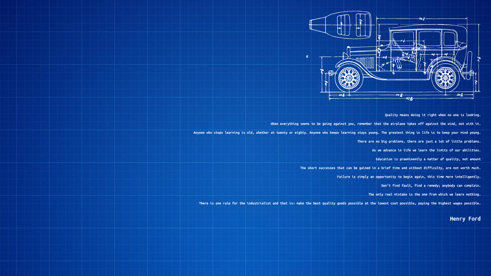

# Henry Ford Quotes Wallpaper

## Used Quotes

* Quality means doing it right when no one is looking.
* When everything seems to be going against you, remember that the airplane takes off against the wind, not with it.
* Anyone who stops learning is old, whether at twenty or eighty. Anyone who keeps learning stays young. The greatest thing in life is to keep your mind young.
* There are no big problems, there are just a lot of little problems.
* As we advance in life we learn the limits of our abilities.
* Education is preeminently a matter of quality, not amount
* The short successes that can be gained in a brief time and without difficulty, are not worth much.
* Failure is simply an opportunity to begin again, this time more intelligently.
* Don’t find fault, find a remedy; anybody can complain.
* The only real mistake is the one from which we learn nothing.
* There is one rule for the industrialist and that is: make the best quality goods possible at the lowest cost possible, paying the highest wages possible.

## Links

* car - http://www.smcars.net/attachments/1928-29_ford-a-town-sedan-jpg.105974/
* blueprint - https://wallpapersinside.com/wallpapers/l/1600x900/80/blueprint-1600x900-79849.jpg
* quotes 
    * https://www.thehenryford.org/collections-and-research/digital-resources/popular-topics/henry-ford-quotes/
    * http://www.business2community.com/customer-experience/31-henry-ford-quotes-about-leadership-and-customer-experience-0572579#05RaAWjAD00FwUuM.97

## Keywords

Henry Ford, Quotes, Wallpaper, Car, Blueprint, Adobe Illustrator, PNG